<div align="center">


# 🏛️ CampusCare

### _Smart Campus Infrastructure with Real-Time Heatmaps, AI Insights & Community Rewards_


[](https://opensource.org/licenses/MIT)
[](https://nodejs.org/)
[](https://www.typescriptlang.org/)
[](https://nextjs.org/)

---

### 🌟 **Built with Firebase, Gemini AI & Modern Web Technologies** 🌟

[](https://firebase.google.com/)
[](https://ai.google.dev/)
[](https://leafletjs.com/)
[](https://railway.app/)

---

<p align="center">
  
  
  
  
</p>


</div>

---

## 📋 Table of Contents

- [The Problem](#-the-problem)
- [Our Solution](#-our-solution)
- [Technology Stack](#-technology-stack)
- [Core Features](#-core-features)
- [System Architecture](#️-system-architecture)
- [Getting Started](#-getting-started)
- [Deployment](#-deployment)
- [Contributing](#-contributing)

---

## 🎯 The Problem

Campus infrastructure breaks down. A lot. And when it does, the response is almost always **reactive** rather than preventive:

**The Reality:**

- 💧 Water leaks in the same spots, semester after semester
- ⚡ Power outages disrupt classes without warning
- 📶 WiFi dead zones frustrate students and faculty
- 🚽 Sanitation issues impact health and comfort
- 🔧 Maintenance teams work blind, without data

**Why Traditional Systems Fail:**

Most campuses rely on scattered complaint emails, phone calls, or paper forms. There's no central intelligence, no pattern recognition, no way to see which buildings are problem hotspots, and no data to justify budget allocation.

> **The Gap:** Without spatial intelligence and trend analysis, every issue feels new. Resources get wasted on symptoms while root causes go unaddressed.

---

## 💡 Our Solution

**CampusCare transforms scattered complaints into actionable intelligence.**

We combine **real-time geospatial visualization**, **AI-powered insights**, and **community engagement** to help campuses shift from reactive firefighting to data-driven infrastructure planning.

### 🎯 How It Works

```
📱 Report → 🗺️ Visualize → 📊 Analyze → 🤖 AI Insights → ⚡ Prioritize → ✅ Resolve
```

<table>
<tr>
<td width="50%" valign="top">

### ✨ What Makes Us Different

**🗺️ See the Patterns**  
Interactive heatmaps show where problems cluster. One glance reveals chronic trouble zones.

**🎯 Know What Matters**  
AI-powered priority scoring ranks issues by urgency, frequency, and impact - not just chronology.

**🤖 Understand Why**  
Gemini AI analyzes trends and explains them in plain English: "Building A has 3x more electrical issues than average."

**🏆 Engage the Community**  
Voting system lets users upvote critical issues. Leaderboard rewards active reporters with points and recognition.

**📧 Stay Informed**  
Auto-email notifications when issues are reported, resolved, or deleted - keeping everyone in the loop.

</td>
<td width="50%" valign="top">

### 🚀 Key Capabilities

**Real-Time Intelligence**

- Live heatmaps with severity weighting
- Dynamic filters (category, time, building)
- Historical trend analysis

**Smart Prioritization**

- AI risk scoring per zone
- Community voting influence
- Predictive maintenance queues

**Admin Power Tools**

- Complete user & issue management
- System-wide analytics dashboard
- Export reports (CSV/JSON)
- Bulk operations

**Community Rewards**

- Points for reporting issues
- Vote multipliers for engagement
- Public leaderboard
- Recognition badges

</td>
</tr>
</table>

**The Result?** Administrators get a data-backed command center. Maintenance teams know where to focus. Students feel heard. And the campus infrastructure actually gets better over time.

---

## �️ Technology Stack

<div align="center">


</div>

<table>
<tr>
<td width="50%" valign="top">

### 💻 **Frontend**


- ⚡ Next.js 14 with App Router
- 🎨 Tailwind CSS + Shadcn UI
- 🗺️ Leaflet + OpenStreetMap
- 📊 Recharts for analytics
- 🔔 React Hot Toast notifications

</td>
<td width="50%" valign="top">

### ⚙️ **Backend**


- 🔒 Express + TypeScript APIs
- 🔥 Firebase Admin SDK
- 📧 Nodemailer for emails
- 🐳 Docker containerization
- 🚂 Railway deployment

</td>
</tr>
<tr>
<td width="50%" valign="top">

### 💾 **Database & Storage**


- 📄 Firestore NoSQL database
- 🗺️ GeoPoint for spatial queries
- 🖼️ Firebase Storage for images
- ⚡ Real-time data sync
- 🔍 Composite indexes

</td>
<td width="50%" valign="top">

### 🤖 **AI & Intelligence**


- 🧠 Gemini 1.5 Flash API
- 🔐 Firebase Authentication
- 📊 AI-powered insights
- 🎯 Risk scoring algorithms
- 📝 Natural language reports

</td>
</tr>
</table>

---

## ✨ Core Features

<div align="center">


</div>

<table>
<tr>
<td width="50%" valign="top">

### 🗺️ **Interactive Heatmaps**

- Real-time issue density visualization
- Severity-weighted heat intensity
- Dynamic filters (category, status, building)
- Critical zone identification
- Custom campus boundaries

</td>
<td width="50%" valign="top">

### 🎯 **Smart Prioritization**

- AI-powered risk scoring
- Community voting system
- Recurrence analysis
- Priority-based queues
- Automated triage

</td>
</tr>
<tr>
<td width="50%" valign="top">

### 🤖 **AI Insights (Gemini)**

- Plain-English analysis
- Pattern recognition
- Trend reports
- Root cause suggestions
- Natural language queries

</td>
<td width="50%" valign="top">

### 🏆 **Community Rewards**

- Points for issue reporting
- Vote multipliers
- Public leaderboard
- Recognition badges
- Engagement tracking

</td>
</tr>
<tr>
<td width="50%" valign="top">

### 👥 **Admin Dashboard**

- User management (CRUD)
- Issue oversight & bulk actions
- System-wide analytics
- Export reports (CSV/JSON)
- Activity monitoring

</td>
<td width="50%" valign="top">

### 📧 **Email Notifications**

- Beautiful HTML templates
- Issue reported alerts
- Resolution notifications
- Deletion confirmations
- OAuth welcome emails

</td>
</tr>
<tr>
<td width="50%" valign="top">

### 🔐 **Authentication**

- Email/password login
- Google OAuth
- Role-based access control
- JWT token security
- Profile management

</td>
<td width="50%" valign="top">

### 📊 **Analytics & Trends**

- Historical pattern analysis
- Category breakdowns
- Building-wise metrics
- Time-series charts
- Predictive insights

</td>
</tr>
</table>

---

## 🏗️ System Architecture

```mermaid
%%{init: {'theme':'base', 'themeVariables': { 'primaryColor':'#1976d2','primaryTextColor':'#fff','primaryBorderColor':'#0d47a1','lineColor':'#424242','secondaryColor':'#388e3c','tertiaryColor':'#f57c00','noteBkgColor':'#fff9c4','noteTextColor':'#000'}}}%%
graph TB
    subgraph Frontend["🖥️ Frontend - Vercel"]
        NextJS["Next.js 14<br/>App Router + RSC"]
        Leaflet["Leaflet Maps<br/>Real-time Heatmaps"]
        AdminUI["Admin Dashboard<br/>Charts & Analytics"]
    end

    subgraph Backend["⚙️ Backend - Railway"]
        Express["Express + TypeScript<br/>REST API"]
        AdminModule["Admin Module<br/>User/Issue Management"]
        EmailService["Nodemailer<br/>HTML Templates"]
    end

    subgraph Data["💾 Data Layer"]
        Firestore["Firebase Firestore<br/>GeoPoint Queries"]
        FirebaseAuth["Firebase Auth<br/>JWT Tokens"]
    end

    subgraph AI["🤖 AI Layer"]
        Gemini["Gemini 1.5 Flash<br/>Natural Language Insights"]
    end

    NextJS --> Express
    Leaflet --> NextJS
    AdminUI --> AdminModule
    Express --> Firestore
    Express --> FirebaseAuth
    Express --> Gemini
    EmailService --> Express
    AdminModule --> Firestore

    style Frontend fill:#1976d2,stroke:#0d47a1,stroke-width:2px,color:#fff
    style Backend fill:#388e3c,stroke:#2e7d32,stroke-width:2px,color:#fff
    style Data fill:#7b1fa2,stroke:#6a1b9a,stroke-width:2px,color:#fff
    style AI fill:#f57c00,stroke:#e65100,stroke-width:2px,color:#fff
```



### **Architecture Layers**

<table>
<tr>
<td width="25%" align="center">

#### 🎨 Frontend

**Next.js 14**

- App Router
- React Server Components
- Leaflet heatmaps
- Admin dashboard

</td>
<td width="25%" align="center">

#### ⚙️ Backend

**Express API**

- TypeScript
- Railway deployment
- 40+ endpoints
- Email service

</td>
<td width="25%" align="center">

#### 💽 Database

**Firestore**

- GeoPoint queries
- Composite indexes
- Real-time sync
- Role-based access

</td>
<td width="25%" align="center">

#### 🤖 AI

**Gemini AI**

- Plain-English reports
- Pattern analysis
- Trend insights
- 1500 req/day

</td>
</tr>
</table>

---

## 🛠️ Technology Stack

<div align="center">


</div>

<table>
<tr>
<td width="50%" valign="top">

### 💻 **Frontend Stack**


**Features:**

- 🚀 Server-side rendering for performance
- 🎨 Modern UI with Tailwind CSS
- 📱 Responsive design
- ⚡ Optimized for speed
- 🗺️ OpenStreetMap + Leaflet integration

</td>
<td width="50%" valign="top">

### ⚙️ **Backend Stack**


**Features:**

- 🔒 Type-safe APIs with TypeScript
- 🔥 Firebase SDK for database
- 🐳 Containerized deployment
- 🔐 Firebase authentication
- 📊 RESTful architecture
- 💰 **100% Free hosting**

</td>
</tr>
<tr>
<td colspan="2" align="center">

### ☁️ **Google Cloud Platform Suite**

<table>
<tr>
<td align="center" width="16.66%">


**Serverless<br/>Containers**

</td>
<td align="center" width="16.66%">


**NoSQL +<br/>Geospatial**

</td>
<td align="center" width="16.66%">


**Interactive<br/>Maps**

</td>
<td align="center" width="16.66%">


**AI<br/>Insights**

</td>
<td align="center" width="16.66%">


**Auth &<br/>Hosting**

</td>
<td align="center" width="16.66%">


**Open Source<br/>Maps**

</td>
</tr>
</table>

</td>
</tr>
</table>

---

## 📊 Data Model

### Infrastructure Issue Entity

| Field       | Type     | Description                                |
| ----------- | -------- | ------------------------------------------ |
| issue_id    | UUID     | Unique identifier                          |
| category    | Enum     | Water, Electricity, WiFi, Sanitation, etc. |
| latitude    | Float    | Geographic latitude                        |
| longitude   | Float    | Geographic longitude                       |
| severity    | Integer  | Severity level (1-5)                       |
| timestamp   | DateTime | Issue creation time                        |
| status      | Enum     | Open, In Progress, Resolved                |
| description | Text     | Issue details                              |
| building_id | String   | Associated building identifier (optional)  |

---

## 🚀 Quick Start

<div align="center">


</div>

### 📋 Prerequisites

<table>
<tr>
<td width="33%" align="center">


**v18 or higher**

</td>
<td width="33%" align="center">


**Free Spark Plan**

</td>
<td width="33%" align="center">


**From AI Studio**

</td>
</tr>
</table>

### ⚡ 3-Step Setup

<table>
<tr>
<td width="33%" valign="top">

#### **1️⃣ Firebase Setup**

```bash
# Create Firebase project
# (console.firebase.google.com)

# Enable Firestore
# Enable Authentication
# Download service account key
```

**Get:**

- Project ID
- Service account JSON
- Web app config

📖 [Full Guide](docs/FIREBASE_SETUP.md)

</td>
<td width="33%" valign="top">

#### **2️⃣ Backend Deploy**

```bash
cd backend
npm install

# Add .env file
FIREBASE_SERVICE_ACCOUNT_KEY='{...}'
GOOGLE_GEMINI_API_KEY='your_key'
EMAIL_USER='your@gmail.com'
EMAIL_PASS='app_password'

# Deploy to Railway
npm run build
```

📖 [Railway Guide](backend/RAILWAY_DEPLOYMENT.md)

</td>
<td width="33%" valign="top">

#### **3️⃣ Frontend Deploy**

```bash
cd frontend
npm install

# Add .env.local
NEXT_PUBLIC_API_URL='https://your-api.railway.app'
NEXT_PUBLIC_FIREBASE_CONFIG='{...}'

# Run locally
npm run dev

# Deploy to Vercel
vercel --prod
```

📖 [Integration Guide](FRONTEND_BACKEND_INTEGRATION_REPORT.md)

</td>
</tr>
</table>

### 🌐 Access Points

<div align="center">

| Service            | URL                   | Description               |
| ------------------ | --------------------- | ------------------------- |
| 🎨 **Frontend**    | http://localhost:3000 | Next.js app with heatmaps |
| ⚙️ **Backend**     | http://localhost:3001 | Express API on Railway    |
| 🔥 **Firestore**   | Firebase Console      | Database & authentication |
| 📧 **Admin Panel** | /admin/dashboard      | User/issue management     |

</div>

---

### 🔑 Get API Keys (All Free!)

<details>
<summary><b>🤖 Gemini API Key</b> (1500 requests/day)</summary>

1. Visit [aistudio.google.com](https://aistudio.google.com/app/apikey)
2. Click "Create API Key"
3. Copy to `GOOGLE_GEMINI_API_KEY` in .env

</details>

<details>
<summary><b>🔥 Firebase Config</b> (No credit card)</summary>

1. Go to [Firebase Console](https://console.firebase.google.com)
2. Create new project
3. Enable Firestore Database
4. Enable Authentication (Email & Google)
5. Project Settings → Service Accounts → Generate new private key
6. Copy JSON to `FIREBASE_SERVICE_ACCOUNT_KEY`

</details>

<details>
<summary><b>📧 Gmail SMTP</b> (For email notifications)</summary>

1. Enable 2FA on your Google account
2. Generate App Password: [myaccount.google.com/apppasswords](https://myaccount.google.com/apppasswords)
3. Add to .env:
   ```
   EMAIL_USER=your@gmail.com
   EMAIL_PASS=your_16_char_app_password
   ```

</details>

---

### 📄 Environment Variables

**Backend (.env):**

```env
FIREBASE_SERVICE_ACCOUNT_KEY='{"type":"service_account",...}'
GOOGLE_GEMINI_API_KEY='AIzaSy...'
EMAIL_USER='your@gmail.com'
EMAIL_PASS='your_app_password'
PORT=3001
FRONTEND_URL='http://localhost:3000'
```

**Frontend (.env.local):**

```env
NEXT_PUBLIC_API_URL='http://localhost:3001'
NEXT_PUBLIC_FIREBASE_CONFIG='{"apiKey":"...","authDomain":"...",...}'
```

## 📁 Project Structure

```
campuscare/
├── 📄 README.md                    # You are here!
├── 🐳 docker-compose.yml           # Multi-service orchestration
├── 📚 docs/                        # Comprehensive documentation
│   ├── FIREBASE_SETUP.md          # Firebase configuration guide
│   ├── architecture/              # System design docs
│   ├── api/                       # API specifications
│   └── prompts/                   # AI prompt templates
│
├── ⚙️ backend/                     # Node.js + Express + TypeScript
│   ├── src/
│   │   ├── config/                # Firebase initialization
│   │   ├── modules/               # Feature modules
│   │   │   ├── issues/           # Issue management
│   │   │   ├── analytics/        # Data analytics
│   │   │   ├── ai/               # Gemini integration
│   │   │   └── auth/             # Firebase auth
│   │   ├── middlewares/          # Express middleware
│   │   ├── types/                # TypeScript definitions
│   │   └── utils/                # Helper functions
│   └── package.json              # Dependencies (Firebase Admin)
│
├── 🎨 frontend/                    # Next.js 14 + TypeScript
│   ├── src/
│   │   ├── app/                  # Next.js app router
│   │   ├── components/           # React components
│   │   │   ├── Map/             # Leaflet + OpenStreetMap
│   │   │   ├── Charts/          # Data visualization
│   │   │   └── Dashboard/       # Admin interface
│   │   ├── lib/                 # Firebase SDK & utilities
│   │   └── styles/              # Tailwind CSS
│   └── public/                  # Static assets
│
├── 📊 analytics/                   # Analytics Scripts
│   └── firestore/              # Firestore queries & aggregations
│
└── 🏗️ infra/                       # Infrastructure as Code
    ├── firebase.json             # Firebase hosting
    └── firestore.rules           # Firestore security rules
```

---

## 🧪 Testing

```powershell
# Backend tests
cd backend
npm test
npm run test:coverage

# Frontend tests
cd frontend
npm test
```

## 📦 Deployment

<div align="center">


### **Deploy to Google Cloud Platform in Minutes**


</div>

<table>
<tr>
<td width="50%" valign="top">

### ⚙️ **Backend (Cloud Run)**

```powershell
# Build and deploy
cd backend
gcloud run deploy campuscare-backend \
  --source . \
  --platform managed \
  --region us-central1 \
  --allow-unauthenticated
```

**Auto-configured:**

- ✅ Automatic HTTPS
- ✅ Firebase integration
- ✅ Environment secrets
- ✅ Health checks
- ✅ Free tier: 10GB bandwidth

</td>
<td width="50%" valign="top">

### 🎨 **Frontend (Firebase/Vercel)**

```powershell
# Build Next.js app
cd frontend
npm run build

# Deploy to Firebase
firebase deploy --only hosting

# Or deploy to Vercel
vercel --prod
```

**Features:**

- ✅ Global CDN
- ✅ Automatic SSL
- ✅ Optimized builds
- ✅ Preview deployments
- ✅ Analytics included

</td>
</tr>
</table>

---

## 🔒 Security & Best Practices

<table>
<tr>
<td width="33%" align="center">

### 🛡️ **Authentication**


- Multi-provider support
- JWT token validation
- Session management
- Role-based access control

</td>
<td width="33%" align="center">

### 🔐 **Data Protection**


- SQL injection prevention
- XSS protection
- CSRF tokens
- Input sanitization
- Environment encryption

</td>
<td width="33%" align="center">

### ⚡ **Rate Limiting**


- API throttling
- DDoS protection
- Request validation
- IP whitelisting
- Quota management

</td>
</tr>
</table>

---

## 📈 Scalability & Future Roadmap

<div align="center">

### **Built to Scale: Campus → Multi-Campus → Smart City**

</div>

<table>
<tr>
<td width="25%" align="center">

### 🏢 **Multi-Campus**


Extend to multiple institutions with tenant isolation

</td>
<td width="25%" align="center">

### 📱 **IoT Integration**


Connect real-time sensors for automated monitoring

</td>
<td width="25%" align="center">

### 📲 **Mobile Apps**


Native iOS/Android apps for field staff

</td>
<td width="25%" align="center">

### 🌆 **Smart City**


Scale to public infrastructure management

</td>
</tr>
</table>

---

## 🤝 Contributing

<div align="center">


</div>



```mermaid
graph LR
    A[🍴 Fork] --> B[🌿 Branch]
    B --> C[💻 Code]
    C --> D[✅ Test]
    D --> E[📝 Commit]
    E --> F[🚀 Push]
    F --> G[🔄 Pull Request]

    style A fill:#e3f2fd
    style G fill:#c8e6c9
```

**Quick Steps:**

1. 🍴 Fork the repository
2. 🌿 Create feature branch (`git checkout -b feature/AmazingFeature`)
3. 💻 Make your changes
4. ✅ Add tests
5. 📝 Commit (`git commit -m 'Add AmazingFeature'`)
6. 🚀 Push to branch (`git push origin feature/AmazingFeature`)
7. 🔄 Open a Pull Request

---

## 📄 License

<div align="center">


This project is licensed under the **MIT License** - see the [LICENSE](LICENSE) file for details.

</div>

---

## 🙏 Acknowledgments

<table>
<tr>
<td width="25%" align="center">


**Cloud Infrastructure**

Serverless computing, managed databases, and global CDN

</td>
<td width="25%" align="center">


**AI Intelligence**

Natural language insights and automated report generation

</td>
<td width="25%" align="center">


**Interactive Maps**

Open source mapping with no API key required

</td>
<td width="25%" align="center">


**Open Source Maps**

Free, unlimited map tiles with no API key required

</td>
</tr>
</table>

---

## 📞 Contact & Support

<div align="center">


[](https://github.com/deepaksoni47/CIIS)
[](./docs/)
[](https://github.com/deepaksoni47/CIIS/issues)
[](https://discord.gg/your-invite)

**Project Link:** [https://github.com/deepaksoni47/CIIS](https://github.com/deepaksoni47/CIIS)

</div>

---

<div align="center">


## 🌟 **Star this repository if you find it useful!** 🌟


---

**© 2025 CampusCare Team | MIT License**

</div>
